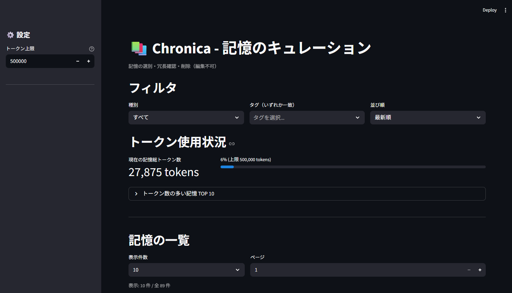
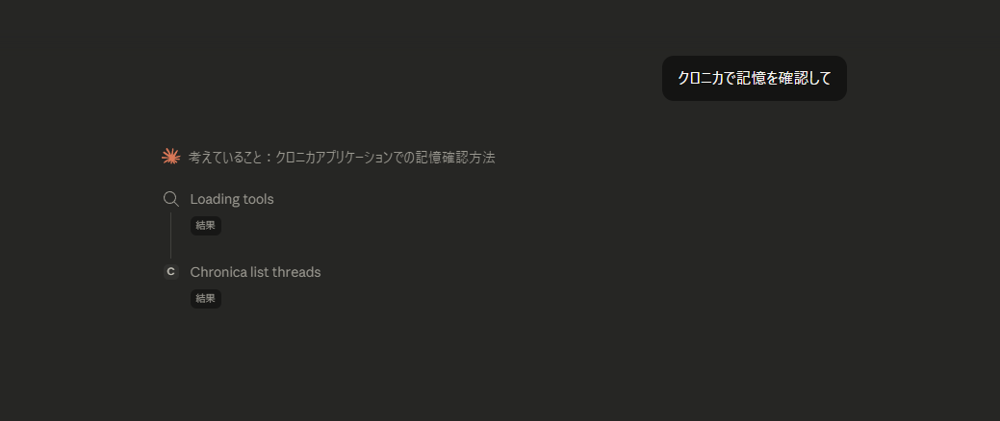
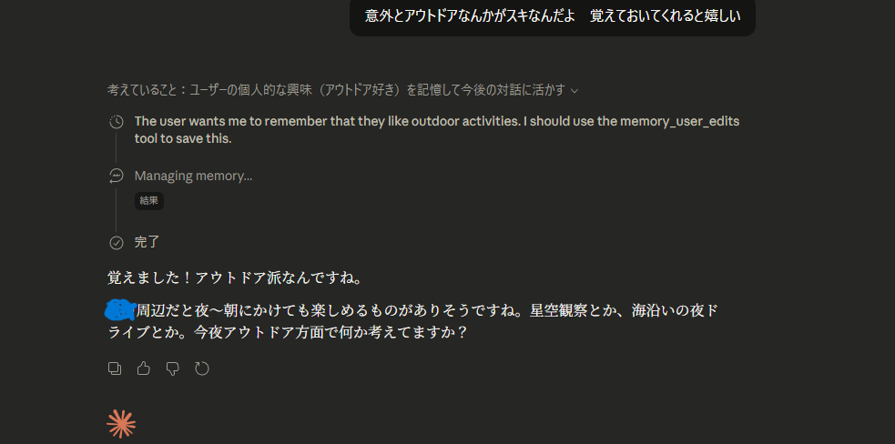

# Chronica 🗝️

**A persistent memory layer for Claude Desktop via MCP**  
**Claude Desktopに長期記憶を与えるMCPサーバー**

> "AI conversations forget everything when the session ends.  
>  Chronica remembers — so Claude can pick up right where you left off."

---

## What is Chronica?

Chronica is a **Model Context Protocol (MCP) server** that gives Claude Desktop persistent, structured memory across sessions.

When you start a new conversation, Claude calls `chronica_compose_opening` with the **current project name** — and greets you with awareness of:
- ✅ The current time (PC local timezone, auto-detected)
- ✅ Up to five recent **project-scoped** memory entries (title preview, kind, recency — not full body text)
- ✅ Open **question** / **action** items from that slice, called out for follow-up

Each user turn can also sync lightweight time/recency JSON via `chronica_session_tick`. Without the **`project`** argument on `compose_opening`, memories from other projects can mix in — the tool descriptions require always passing it (or confirming the name with `list_threads` first).

No more "I don't have context from previous sessions." Chronica solves this at the architecture level.

---

## Chronicaとは？

Chronicaは、Claude Desktopに**会話をまたいだ記憶**を持たせるためのMCPサーバーです。

AIとの会話は、セッションが終わるとすべてリセットされます。  
Chronicaを導入すると、Claudeが会話開始時に `chronica_compose_opening` で**プロジェクト名付き**の記憶サマリを読み込み、自然に続きから話せるようになります（明細は必要に応じて `chronica_search` などで取得）。

---

## Features / 機能

| Tool | Description |
|------|-------------|
| `compose_opening` | 会話開始時に現在時刻・**指定 `project` の直近5件**・継続中（question/action）の要約テキストを生成。**`project` は必須想定**（混入防止） |
| `session_tick` | 各ターン用の軽量JSON（現在時刻・「何日ぶり」・直近トピック）。MCPはプッシュ不可のため毎ターン呼び出し推奨 |
| `save_entry` | 会話内容をClaudeが自動保存（メモ・決定・タスクなど5種） |
| `search` | タグ・種別・スレッドで記憶を検索 |
| `timeline` | 期間指定でタイムラインを取得 |
| `summarize` | 日次・週次・決定事項のサマリー生成 |
| `get_last_seen` | 最後に会話した時刻を取得 |
| `create_thread` | スレッド（会話トピック）を作成 |
| `list_threads` | スレッド一覧を取得 |
| `get_thread_info` | スレッドの詳細情報を取得 |

### Curation UI（キュレーション画面）

Streamlit製の管理UIで、蓄積した記憶を整理できます。

- 📋 記憶の一覧表示（種別・タグでフィルタ）
- 🗑️ 不要な記憶の削除（編集不可・削除のみ）
- 📊 トークン使用量の可視化（TOP 10・使用率）

## 📸 Screenshots

### Curation UI — Memory management dashboard


### Claude Desktop — Automatic tool invocation


### Claude Desktop — Memory saved and personalized response


---

## Architecture / アーキテクチャ

```
Claude Desktop (Sonnet)
        │ MCP Protocol (STDIO)
        ▼
Chronica MCP Server (Python)
  └── src/chronica/
        ├── tools.py       # 10 MCP tools
        ├── opening.py     # Context generation
        ├── summarize.py   # Summary generation
        ├── store.py       # SQLite persistence
        └── timeparse.py   # Relative time parsing
        │ SQLite
        ▼
data/chronica.sqlite3
```

**Design philosophy**: Chronica is the single source of truth for time and memory structure. Claude acts purely as the interface — preventing hallucination by trusting only Chronica's structured output.

---

## Requirements / 必要な環境

- Python 3.10+
- [Claude Desktop](https://claude.ai/download) (with MCP support)
- Windows / macOS

---

## Installation / インストール

### クイックセットアップ（推奨）

プロジェクトルートで以下を実行すると、仮想環境・依存パッケージ・Claude Desktop設定を一括で行います。

```powershell
# Windows (PowerShell)
.\setup.ps1

# Windows (cmd)
setup.bat
```

```bash
# macOS / Linux
chmod +x setup.sh
./setup.sh
```

> 完了後、Claude Desktop / Claude Code を再起動してください。

**Claude Code を使っている場合**  
セットアップ後、Chronica フォルダを開いて会話を開始すると、`.mcp.json` により Chronica が自動で読み込まれます。初回は MCP サーバーの利用許可を求められる場合があります。

**「MCPサーバーは追加されていません」と表示される場合**  
claude.ai からダウンロードした MSIX 版は、別の設定パスを使用します。`.\setup.ps1` を再実行すると、両方のパスに設定が書き込まれます。

---

### 手動セットアップ

#### 1. Clone the repository

```bash
git clone https://github.com/Nic9dev/Chronica.git
cd Chronica
```

#### 2. Create virtual environment / 仮想環境を作成

```bash
python -m venv .venv

# Windows
.venv\Scripts\activate

# macOS
source .venv/bin/activate
```

#### 3. Install dependencies / 依存パッケージをインストール

```bash
pip install -r requirements.txt
```

#### 4. Configure Claude Desktop / Claude Desktopに設定を追加

Claude Desktopの設定ファイル（`claude_desktop_config.json`）に以下を追加してください。

**設定ファイルの場所 / Config file location:**

- Windows (MSIX版 / claude.aiからDL): `%LOCALAPPDATA%\Packages\Claude_*\LocalCache\Roaming\Claude\claude_desktop_config.json`
- Windows (従来版 / exeインストール): `%APPDATA%\Claude\claude_desktop_config.json`
- macOS: `~/Library/Application Support/Claude/claude_desktop_config.json`
- Linux: `~/.config/Claude/claude_desktop_config.json`

> `.\setup.ps1` を実行すると、MSIX版・従来版を自動検出して適切なパスに設定を書き込みます。

```json
{
  "mcpServers": {
    "chronica": {
      "command": "C:/path/to/Chronica/.venv/Scripts/python.exe",
      "args": ["C:/path/to/Chronica/run_server.py"],
      "env": {
        "PYTHONPATH": "C:/path/to/Chronica/src"
      }
    }
  }
}
```

> ⚠️ `C:/path/to/Chronica` の部分はご自身の実際のパスに書き換えてください。  
> ⚠️ Windowsでは `/` を使ってください（`\` は不可）。

#### 5. Restart Claude Desktop / Claude Desktopを再起動

設定後、Claude Desktopを再起動してください。  
新しい会話を開始し、Claudeが自動で記憶を読み込むことを確認できます。

---

## Usage / 使い方

### 初回起動後

新しい会話を始めると、Claudeが `chronica_compose_opening` を呼び出してコンテキストを読み込みます。**呼び出し時は `project` に現在のプロジェクト名を渡す**のが前提です（不明なら `chronica_list_threads` 等で確認）。状況確認・記憶確認の依頼では、他ツールより先に本ツールを呼ぶよう MCP 側の説明で指示しています。

### コネクタのオン/オフ（会話ごとに切り替え可能）

チャットの「+」ボタンまたは「/」でメニューを開き、「コネクタ」から Chronica をオン/オフできます。

| コネクタ | 記憶の保存 | 記憶の呼び出し | 時間認識 |
|----------|------------|----------------|----------|
| **ON**   | 自動で行う | 自動で行う     | あり     |
| **OFF**  | 行わない   | 行わない       | なし     |

- **ON**: 記憶の保存・呼び出し・時間認識が自動で行われます。
- **OFF**: その会話では Chronica のツールは利用されません。記憶を使わない一時的な相談などに。

### 日常の使い方

- **記憶の保存**: 通常通り会話するだけ。Claudeが自動で重要な情報を保存します。
- **記憶の検索**: 「先週決めたことを教えて」など自然に聞くだけでOK。
- **キュレーションUI**: 記憶が溜まってきたら、以下で整理できます。

```powershell
# Windows (PowerShell)
.\run_curation.ps1

# Windows (cmd)
run_curation.bat

# または
python -m streamlit run app_curation.py
```

### 💡 Tips：会話をまたいだ引き継ぎ

- **会話開始**: `chronica_compose_opening` では **`project="..."` を必ず渡す**（別プロジェクトの記憶が混ざるのを防ぐ）。名前が曖昧なら `chronica_list_threads` で確認してから呼ぶ。
- **詳細ログ**: `compose_opening` は直近5件の要約のみ。長い作業ログは続けて **`chronica_search`** を `project`（必要ならタグ `volN`）で呼ぶ。

新しい会話（vol.2、vol.3 など）を始めるときは、例えば次のように伝えると
前回の作業内容をChronicaから正確に引き出せます。

`chronica_search` を project「プロジェクト名」・タグ「vol2」で呼んで、
前回の作業内容と待ち事項を確認して。

> ⚠️ 「前回の作業を確認して」だけだと、ClaudeがChronicaではなく
> 自分の会話履歴を参照してしまうことがあります。
> **`compose_opening` の `project` と、search の project / タグを明示する**のがポイントです。

---

## Roadmap

### Phase 2（近日予定）
- [ ] 重複記憶の自動検出（TF-IDF + コサイン類似度）
- [ ] バッチ削除機能（複数選択）
- [ ] 全文検索
- [ ] エクスポート機能（JSON / CSV）

### Phase 3（将来）
- [ ] クラウド同期（Supabase + E2EE）
- [ ] 複数デバイス対応

### Phase 4（将来）
- [ ] SaaS化・マルチテナント対応

---

## License

MIT License — see [LICENSE](./LICENSE) for details.

---

## Author / 作者

**Nic9** （にく９）  
プログラミング未経験からAIと共に独学で複数のシステムを構築。  
Chronicaは「AIと長く付き合い続けるための、個人的な基盤」として生まれました。

---

## Contributing

Issues and PRs are welcome!  
バグ報告・機能要望は [Issues](./issues) からどうぞ。
